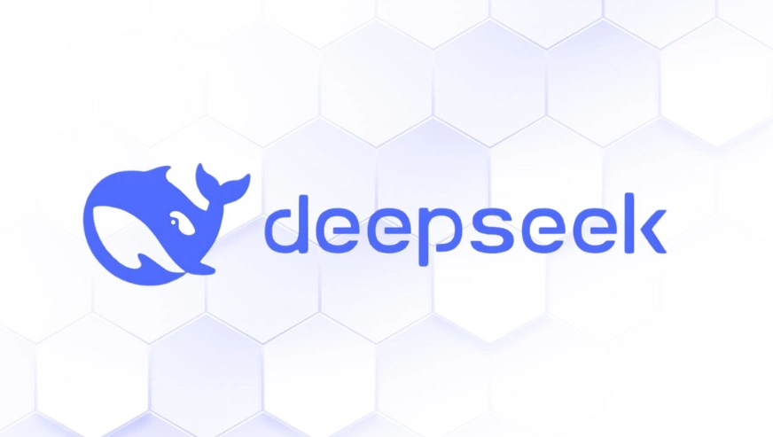

<!-- Banner -->

# Awesome DeepSeek 

**DeepSeek** is a suite of state-of-the-art models including DeepSeek-LM (language models), DeepSeek-VL (vision-language), DeepSeek-Coder (coding assistant), and more. This repository curates the best resources, tutorials, tools, and projects around DeepSeek to help researchers, developers, and enthusiasts stay ahead in the evolving AI/ML landscape.

---

## Table of Contents

  
📚 Navigation

  <ol>
    <li><a href="#official-resources">Official Resources</a></li>
    <li><a href="#getting-started--tutorials">Getting Started &amp; Tutorials</a></li>
    <li><a href="#libraries--tools">Libraries &amp; Tools</a></li>
    <li><a href="#use-cases--applications">Use Cases &amp; Applications</a></li>
    <li><a href="#benchmarks--performance-comparisons">Benchmarks &amp; Performance Comparisons</a></li>
    <li><a href="#deepseek-powered-demos--projects">DeepSeek-Powered Demos &amp; Projects</a></li>
    <li><a href="#research--advanced-topics">Research &amp; Advanced Topics</a></li>
    <li><a href="#community-contributions--discussions">Community Contributions &amp; Discussions</a></li>
  </ol>

---

## Official Resources

- **DeepSeek Repositories**

  - [DeepSeek-LM](https://github.com/deepseek/deepseek-lm) - Official repository for DeepSeek language models.
  - [DeepSeek-VL](https://github.com/deepseek/deepseek-vl) - Vision-Language integration resources.
  - [DeepSeek-Coder](https://github.com/deepseek/deepseek-coder) - Resources for coding and development.

- **Research Papers & Documentation**
  - [DeepSeek Whitepaper](https://arxiv.org/abs/xxxx.xxxxx) - The foundational paper behind DeepSeek.
  - [Official Documentation](https://docs.deepseek.ai) - Comprehensive guides and API references.

---

## Getting Started & Tutorials

- **Beginner-Friendly Guides**

  - [Quick Start Guide](docs/tutorials.md#quick-start) - A beginner-friendly overview to get you started.
  - [YouTube Tutorials Playlist](https://youtube.com/playlist?list=PLDeepSeekTutorials) - Video guides for hands-on learning.

- **Example Notebooks**
  - [Colab Notebook: DeepSeek Basics](notebooks/example_notebook.ipynb) - Run in-browser interactive examples.
  - [API Playground](notebooks/api_playground.ipynb) - Step-by-step guide on using DeepSeek’s API.

---

## Libraries & Tools

- **API Integrations**

  - [DeepSeek Python SDK](https://github.com/deepseek/deepseek-python-sdk) - Simplify integration with your projects.
  - [Third-Party Extensions](https://github.com/topics/deepseek-extension) - Community-built enhancements.

- **Additional Tools**
  - [DeepSeek CLI](https://github.com/deepseek/deepseek-cli) - Command-line interface for quick operations.
  - [Dockerized Setup](https://github.com/deepseek/deepseek-docker) - Containerized deployment options.

---

## Use Cases & Applications

- **Real-World Applications**

  - [NLP Applications](https://github.com/yourusername/deepseek-nlp-projects) - Explore how DeepSeek-LM powers state-of-the-art NLP.
  - [Coding Assistance](https://github.com/yourusername/deepseek-coder-demos) - Projects built using DeepSeek-Coder for code generation.
  - [Multimodal AI](https://github.com/yourusername/deepseek-multimodal) - Vision-language applications that harness DeepSeek-VL.

- **Showcase Projects**
  - [Featured Projects](#) - A curated list of projects utilizing DeepSeek across industries.

---

## Benchmarks & Performance Comparisons

- **Comparison Graphs & Tables**
  - [DeepSeek vs. GPT](docs/benchmarks.md#deepseek-vs-gpt)
  - [DeepSeek vs. Llama & Mistral](docs/benchmarks.md#comparisons)
  - **Interactive Dashboard:** [Explore Benchmark Data](https://deepseek.ai/benchmarks)

---

## DeepSeek-Powered Demos & Projects

- **Inspiring Demos**
  - [Demo Gallery](https://deepseek.ai/demos) - Explore demos built on DeepSeek models.
  - [Open-Source Implementations](https://github.com/search?q=deepseek+demo) - Community implementations worth checking out.

---

## Research & Advanced Topics

- **Cutting-Edge Research**

  - [Recent Publications](https://scholar.google.com/scholar?q=DeepSeek) - Latest research papers on DeepSeek.
  - [Fine-Tuning & Optimization](docs/advanced.md#fine-tuning) - Advanced topics for optimizing DeepSeek models.

- **Community Discussions**
  - [GitHub Discussions](https://github.com/yourusername/awesome-deepseek/discussions) - Engage with researchers and developers.

---

## Community Contributions & Discussions

- **Active Forums**

  - [DeepSeek Discord](https://discord.gg/yourserver) - Join our vibrant community.
  - [GitHub Discussions](https://github.com/yourusername/awesome-deepseek/discussions) - Collaborate and share ideas.
  - [Twitter/X](https://twitter.com/yourhandle) - Follow for the latest updates.

- **Top Contributors**
  - A dynamic [Leaderboard](#) showcasing top contributors and monthly highlights.
  - **Recognition:** Get your contributions featured with our **DeepSeek Explorer** badges!

---

## Interactive & Developer-Friendly Features

- **Colab & Jupyter Notebooks:** Explore interactive examples in the [notebooks/](notebooks/) directory.
- **API Playground:** Get hands-on with DeepSeek APIs using our step-by-step guide in [api_playground.ipynb](notebooks/api_playground.ipynb).
- **Automated Link Checking:** We use GitHub Actions to ensure all links remain valid.
- **Badges for Resources:** Look for badges indicating beginner-friendly, trending, or advanced content.
- **Contribution Guidelines:** Please see [CONTRIBUTING.md](CONTRIBUTING.md) for details on how to get involved.

---

## How to Contribute

We welcome contributions that help make **awesome-deepseek** the go-to resource for DeepSeek models. To contribute:

1. **Fork the Repository:** Create your fork and make changes.
2. **Submit a PR:** Follow our [Contribution Guidelines](CONTRIBUTING.md).
3. **Good First Issues:** Check issues labeled ["Good First Issue"](https://github.com/yourusername/awesome-deepseek/labels/good%20first%20issue) for beginner-friendly tasks.

_Your contributions might even earn you a **DeepSeek Explorer** badge or a spot on our leaderboard!_

---

## Newsletter & Updates

Stay up-to-date with the latest from the DeepSeek ecosystem:

- **Newsletter:** [Subscribe here](https://deepseek.ai/newsletter)
- **RSS Feed:** [RSS Feed](https://deepseek.ai/rss)

---

## License

This project is licensed under the [MIT License](LICENSE) <!-- or Apache-2.0, if you prefer. -->

---

## Acknowledgments

- **Credits:** Thank you to all the contributors and maintainers who keep this repository awesome.
- **Shoutouts:** Special thanks to featured projects and open-source integrations that power the DeepSeek ecosystem.
- **Community:** Your support drives us—don't forget to ⭐ Star the repo and share with your network!

---

## Gamification & Engagement 🎮

- **DeepSeek Explorer Badges:** Earn digital badges for your contributions.
- **Monthly Challenges:** Participate in challenges and submit your best DeepSeek projects.
- **Featured Interviews:** Look out for interviews with leading researchers and developers in the DeepSeek ecosystem.

---

_Make awesome-deepseek the #1 resource for everything DeepSeek—your contributions, ideas, and engagement fuel the future of AI! 🚀🔥_
